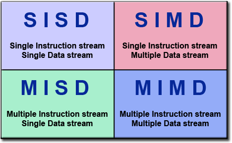
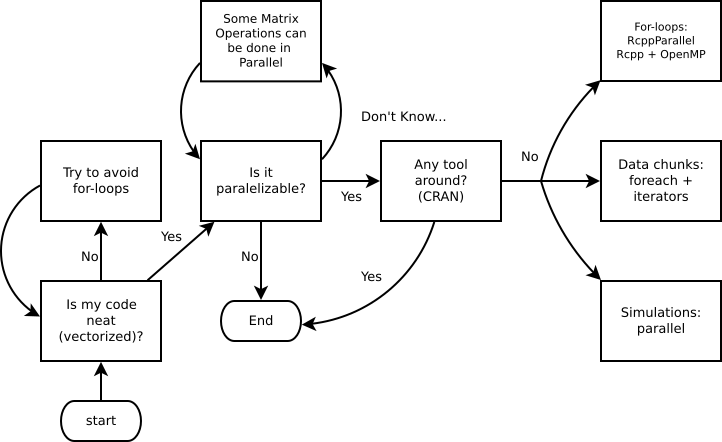

```{r setup, include=FALSE, fig.align='center', warning=FALSE, message=FALSE}
knitr::opts_chunk$set(echo = TRUE, comment = "#")
```

# Agenda

1.  High-Performance Computing: An overview
    
2.  Parallel computing in R
    
3.  Extended examples

# First: How to use R on HPC

There are two things that you need to do to use R in HPC:

1.  **Source the corresponding R version:** For example, if you want to
    work with version 3.4, you could just type
    
    ```bash
    source /usr/usc/R/3.4.0/setup.sh
    ```
    
    You can also include that line in you `~/.bash_profile` file so that is
    done automatically on your login.
    
2.  **Specify the R library path**: In order to be able to use R packages that
    where install in your session while running Slurm (for example), you have
    to specify the library path. There are a couple of ways of doing it:
    
    a.  Use the `.libPaths()` command at the begining of your R script
    b.  Use the `lib.loc` option when calling `library()`
    c.  Use the `.Renviron` file and set the `R_LIBS` value (see `?Renviron`)

We have examples at the end of the presentation.


# High-Performance Computing: An overview

Loosely, from R's perspective, we can think of HPC in terms of two, maybe three things:

1.  Big data: How to work with data that doesn't fit your computer

2.  Parallel computing: How to take advantage of multiple core systems

3.  Compiled code: Write your own low-level code (if R doesn't has it yet...)

(Checkout [CRAN Task View on HPC](https://cran.r-project.org/web/views/HighPerformanceComputing.html))


# Big Data

*   Buy a bigger computer/RAM memory (not the best solution!)
    
*   Use out-of-memory storage, i.e., don't load all your data in the RAM. e.g.
    The [bigmemory](https://CRAN.R-project.org/package=bigmemory),
    [data.table](https://CRAN.R-project.org/package=data.table),
    [HadoopStreaming](https://CRAN.R-project.org/package=HadoopStreaming) R packages

*   Store it more efficiently, e.g.: Sparse Matrices (take a look at the `dgCMatrix` objects
    from the [Matrix](https://CRAN.R-project.org/package=Matrix) R package)

# Parallel computing

```{r, echo=FALSE, fig.cap="Flynn's Classical Taxonomy ([Introduction to Parallel Computing, Blaise Barney, Lawrence Livermore National Laboratory](https://computing.llnl.gov/tutorials/parallel_comp/#Whatis))", fig.align='center'}

```

# GPU vs CPU

```{r, echo=FALSE, fig.cap="[NVIDIA Blog](http://www.nvidia.com/object/what-is-gpu-computing.html)", fig.align='center'}
knitr::include_graphics("fig/cpuvsgpu.jpg")
```

*   **Why are we still using CPUs instead of GPUs?**
    
    > GPUs have far more processor cores than CPUs, but because each GPU core runs
      significantly slower than a CPU core and do not have the features needed for
      modern operating systems, they are not appropriate for performing most of the
      processing in everyday computing. They are most suited to compute-intensive
      operations such as video processing and physics simulations.
      ([bwDraco at superuser](https://superuser.com/questions/308771/why-are-we-still-using-cpus-instead-of-gpus))

*   Why use OpenMP if GPU is _suited to compute-intensive operations_? Well, mostly because
    OpenMP is **VERY** easy to implement (easier than CUDA, which is the easiest way to use GPU).

# When is it a good idea?

```{r, echo=FALSE, fig.cap="Ask yourself these questions before jumping into HPC!", fig.align='center'}

```


# Parallel computing in R

While there are several alternatives (just take a look at the
[High-Performance Computing Task View](https://cran.r-project.org/web/views/HighPerformanceComputing.html)),
we'll focus on the following R-packages for explicit parallelism:

*   **parallel**: R package that provides '[s]upport for parallel computation,
    including random-number generation'.

*   **rslurm**: 'Send long-running or parallel jobs to a Slurm workload manager (i.e. cluster) using the slurm_call or slurm_apply functions.'
    
Implicit parallelism, on the other hand, are out-of-the-box tools that allow the
programmer not to worry about parallelization, e.g. such as
[**gpuR**](https://cran.r-project.org/package=gpuR) for Matrix manipulation using
GPU.

# Parallel workflow

1.  Create a cluster:
    
    a.  PSOCK Cluster: `makePSOCKCluster`: Creates brand new R Sessions (so
        nothing is inherited from the master), even in other computers!
        
    b.  Fork Cluster: `makeForkCluster`: Using OS
        [Forking](https://en.wikipedia.org/wiki/Fork_(system_call)),
        copies the current R session locally (so everything is inherited from
        the master up to that point). Not available on Windows.
    
    c.  Other: `makeCluster` passed to **snow**
    
2.  Copy/prepare each R session:

    a.  Copy objects with `clusterExport`

    b.  Pass expressions with `clusterEvalQ`

    c.  Set a seed
    

3.  Do your call:

    a.  `mclapply`, `mcmapply` if you are using **Fork**

    b.  `parApply`, `parLapply`, etc. if you are using **PSOCK**

    
4.  Stop the cluster with `clusterStop`
    
# parallel example 1: Parallel RNG

```{r parallel-ex1, echo=TRUE}
# 1. CREATING A CLUSTER
library(parallel)
cl <- makePSOCKcluster(2)    

# 2. PREPARING THE CLUSTER
clusterSetRNGStream(cl, 123) # Equivalent to `set.seed(123)`

# 3. DO YOUR CALL
ans <- parSapply(cl, 1:2, function(x) runif(1e3))
(ans0 <- var(ans))

# I want to get the same!
clusterSetRNGStream(cl, 123)
ans1 <- var(parSapply(cl, 1:2, function(x) runif(1e3)))

all.equal(ans0, ans1) # All equal!

# 4. STOP THE CLUSTER
stopCluster(cl)
```

# parallel example 1: Parallel RNG (cont.)

In the case of `makeForkCluster`

```{r parallel-ex1-cont, echo=TRUE, eval = F}
# 1. CREATING A CLUSTER
library(parallel)

# The fork cluster will copy the -nsims- object
nsims <- 1e3
cl    <- makeForkCluster(2)    

# 2. PREPARING THE CLUSTER
RNGkind("L'Ecuyer-CMRG")
set.seed(123) 

# 3. DO YOUR CALL
ans <- do.call(cbind, mclapply(1:2, function(x) {
  runif(nsims) # Look! we use the nsims object!
               # This would have fail in makePSOCKCluster
               # if we didn't copy -nsims- first.
  }))
(ans0 <- var(ans))

# Same sequence with same seed
set.seed(123) 
ans1 <- var(do.call(cbind, mclapply(1:2, function(x) runif(nsims))))

ans0 - ans1 # A matrix of zeros

# 4. STOP THE CLUSTER
stopCluster(cl)
```

# parallel example 2: Simulating $\pi$


*   We know that $\pi = \frac{A}{r^2}$. We approximate it by randomly adding
    points $x$ to a square of size 2 centered at the origin.

*   So, we approximate $\pi$ as $\Pr\{\|x\| \leq 1\}\times 2^2$

```{r, echo=FALSE, dev='jpeg', dev.args=list(quality=100), fig.width=6, fig.height=6, out.width='300px', out.height='300px'}
set.seed(1231)
p    <- matrix(runif(5e3*2, -1, 1), ncol=2)
pcol <- ifelse(sqrt(rowSums(p^2)) <= 1, adjustcolor("blue", .7), adjustcolor("gray", .7))
plot(p, col=pcol, pch=18)
```

The R code to do this

```{r simpi, echo=TRUE}
pisim <- function(i, nsim) {  # Notice we don't use the -i-
  # Random points
  ans  <- matrix(runif(nsim*2), ncol=2)
  
  # Distance to the origin
  ans  <- sqrt(rowSums(ans^2))
  
  # Estimated pi
  (sum(ans <= 1)*4)/nsim
}
```

# parallel example 2: Simulating $\pi$ (cont.)

```{r parallel-ex2, echo=TRUE, cache=TRUE}

# Setup
cl <- makePSOCKcluster(10)
clusterSetRNGStream(cl, 123)

# Number of simulations we want each time to run
nsim <- 1e5

# We need to make -nsim- and -pisim- available to the
# cluster
clusterExport(cl, c("nsim", "pisim"))

# Benchmarking: parSapply and sapply will run this simulation
# a hundred times each, so at the end we have 1e5*100 points
# to approximate pi
rbenchmark::benchmark(
  parallel = parSapply(cl, 1:100, pisim, nsim=nsim),
  serial   = sapply(1:100, pisim, nsim=nsim), replications = 1
)[,1:4]

```

```{r printing-and-stop, cache=TRUE}
ans_par <- parSapply(cl, 1:100, pisim, nsim=nsim)
ans_ser <- sapply(1:100, pisim, nsim=nsim)
stopCluster(cl)
```

```{r, echo=FALSE}
c(par = mean(ans_par), ser = mean(ans_ser), R = pi)
```

# Slurm Example 1

*   Suppose that we would like to maximize/minimize a function using an stochastic
    optimization algorithm, namely, the [**Artificial Bee Colony algorithm**](http://mf.erciyes.edu.tr/abc/index.htm){target="_blank"}
    
*   The following R script ([01-slurm-abcoptim.R](examples/01-slurm-abcoptim.R){target="_blank"}) was designed to work with Slurm
    (it requires the R package ABCoptim [@ABCoptim])
    
```r
# Include this to tell where everything will be living at
.libPaths("~/R/x86_64-pc-linux-gnu-library/3.4/")

# Default CRAN mirror from where to download R packages
options(repos =c(CRAN="https://cloud.r-project.org/"))

# You need to have the ABCoptim R package
library(ABCoptim)

fun <- function(x) {
  -cos(x[1])*cos(x[2])*exp(-((x[1] - pi)^2 + (x[2] - pi)^2))
}

ans <- abc_optim(rep(0,2), fun, lb=-10, ub=10, criter=50)

saveRDS(
   ans,
   file = paste0(
      "~/hpc-with-r/examples/01-slurm-abcoptim-",
      Sys.getenv("SLURM_JOB_ID"),                 # SLURM ENV VAR
      "-",
      Sys.getenv("SLURM_ARRAY_TASK_ID"),          # SLURM ENV VAR
      ".rds"
))
```

*   Notice that we are using `SLURM_JOB_ID`, and `SLURM_ARRAY_TASK_ID` to save
    our results (both environment variables created by slurm)

---

*   To run the previous R script, we can use the following bash file ([01-slurm-abcoptim.sh](examples/01-slurm-abcoptim.sh){target="_blank"})
    
    ```bash
    #!/bin/bash 
    #SBATCH --tasks=1
    #SBATCH --array=1-3
    #SBATCH --job-name=01-slurm-abcoptim
    #SBATCH --output=01-slurm-abcoptim-%A_%a.out
    
    source /usr/usc/R/3.4.0/setup.sh
    Rscript --vanilla ~/hpc-with-r/examples/01-slurm-abcoptim.R 
    ```

*   Here we are taking advantage of the Slurm Arrays, so we are running the same
    R-script in 3 instances (`--array=1-3`)
    
*   To run the job we just need to type
    
    ```bash
    $ sbatch 01-slurm-abcoptim.sh
    ```

*   Make sure you modify the file paths so that it matches your files!
    
<div align="center">
<p style="font-size:40px">Now you try it!</p>
</div>


# RcppArmadillo + OpenMP + Slurm: Using the `rslurm` package

*   The [`rslurm` package ](https://CRAN.R-project.org/package=rslurm){target="_blank"} [@rslurm] provides a wrapper of Slurm in R.

*   Without the need of knowing much about the syntax of `slurm`, this R package does the following:
    
    1.  Writes an R source file that sets up each node with your current config (packages, libpath, etc.). The outputs are stored in a known folder so these can be fetched out later.
    
    2.  Writes a bash file with the call to `sbatch` (you can specify options).
    
    3.  Executes the bash file and returns the jobid (you can query its status interatively).
        
        Here is a simple example with our `sim_pi` function (so we are mixing OpenMP with Slurm!):
        
        ```r
        library(rslurm)
        
        # How many nodes are we going to be using
        nnodes <- 2L
        
        # The slurm_apply function is what makes all the work
        sjob <- slurm_apply(
          # We first define the job as a function
          f = function(n) {
            
            # Compiling Rcpp
            Rcpp::sourceCpp("~/simpi.cpp")
            
            # Returning pi
            sim_pi(1e9, cores = 8, seed = n*100)
            
          },
          # The parameters that `f` receives must be passed as a data.frame
          params        = data.frame(n = 1:nnodes), jobname = "sim-pi",
          
          # How many cpus we want to use (this when calling mcapply)
          cpus_per_node = 1,
          
          # Here we are asking for nodes with 8 CPUS
          slurm_options = list(`cpus-per-task` = 8),
          nodes         = nnodes,
          submit        = TRUE
        )
        
        # We save the image so that later we can use the `sjob` object to retrieve the
        # results
        save.image("~/sim-pi.rda")
        ```

<div align="center">
<p style="font-size:40px">Now you try it!</p>
</div>


# Thanks!

```{r session, echo=FALSE}
sessionInfo()
```

# See also

*   [Package parallel](https://stat.ethz.ch/R-manual/R-devel/library/parallel/doc/parallel.pdf) 
*   [Using the iterators package](https://cran.r-project.org/web/packages/iterators/vignettes/iterators.pdf)
*   [Using the foreach package](https://cran.r-project.org/web/packages/foreach/vignettes/foreach.pdf)
*   [32 OpenMP traps for C++ developers](https://software.intel.com/en-us/articles/32-openmp-traps-for-c-developers)
*   [The OpenMP API specification for parallel programming](http://www.openmp.org/)
*   ['openmp' tag in Rcpp gallery](gallery.rcpp.org/tags/openmp/)
*   [OpenMP tutorials and articles](http://www.openmp.org/resources/tutorials-articles/)

For more, checkout the [CRAN Task View on HPC](https://cran.r-project.org/web/views/HighPerformanceComputing.html){target="_blank"}
