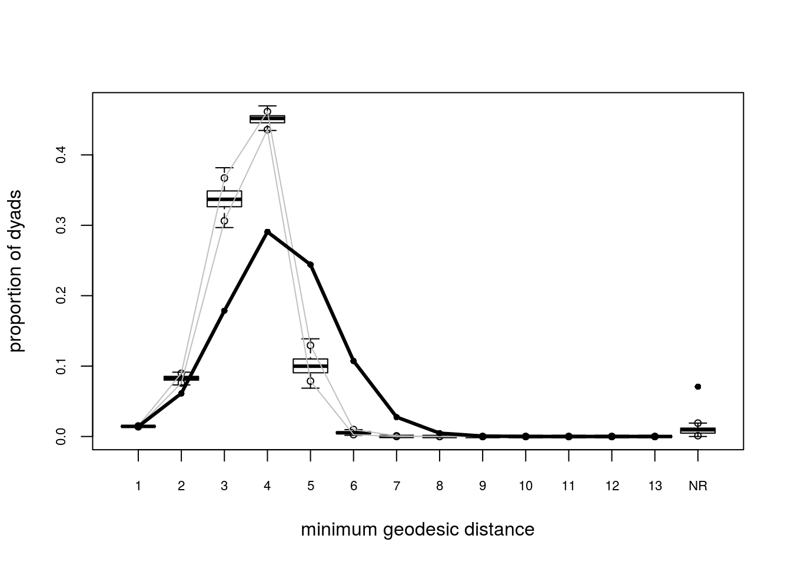

```{r setup, include=FALSE}
knitr::opts_chunk$set(
  echo = FALSE, fig.width=6,
  fig.align = "center"
  )
```

## Models for Social Networks

Today, we will take a brief (very brief) look at the following models:

*   Spatial Auto-correlation Models

*   Exponential Random Graph Models

*   Stochastic Actor Oriented Models

*   Network Matching

First, a brief introduction

## Context: Identifying Contagion in Networks {.smaller}

*   Ideally we would like to estimate a model in the form of 
    $$
    Y_i = f\left(\mathbf{X}, Y_{-i}, \mathbf{G}; \theta\right)
    $$
    
    where $Y_{-i}$ is the behavior of individuals other than $i$ and $\mathbf{G}$ is
    a graph.
    
*   The problem: So far, traditional statistical models won't work, why?
    because most of them rely on having IID observations.
    
*   On top of that, when it comes to explain behavior, "Homophily and Contagion Are Generically Confounded" [@Shalizi2011].

*   This has lead to the development of an important collection of statistical models for social networks.
    
    
## Spatial Autocorrelation Models (SAR a.k.a. Network Auto-correlation Models) {.smaller}

*   Spatial Auto-correlation Models are mostly applied in the context of spatial
    statistics and econometrics.
    
*   A wide family of models, you can find SA equivalents to Probit, Logit, MLogit, etc.
    
*   The SAR model has interdependence built-in using a Multivariate Normal Distribution:
    
    $$
    \begin{align}
    Y = & \alpha + \rho W Y + X\beta + \varepsilon,\quad\varepsilon\sim MVN(0,\sigma^2I_n) \\
    \implies & Y = \left(I_n -\rho W\right)^{-1}(\alpha + X\beta + \varepsilon)
    \end{align}
    $$

    Where $\rho\in[-1,1]$ and $W=\{w_{ij}\}$, with $\sum_j w_{ij} = 1$

## Spatial Autocorrelation Models (SAR) (cont.) {.smaller}

*   This is more close than we might think, since the $i$-th element of $Wy$ can be
    expressed as $\frac{\sum_j a_{ij} y_j}{\sum_j a_{ij}}$, what we usually
    define as exposure in networks, where $a_{ij}$ is an element of the $\{0,1\}$-adjacency
    matrix .
    
*   Notice that $(I_n - \rho W)^{-1} = I_n + \rho W + \rho^2 W^2 + \dots$, hence
    there autocorrelation does consider effects over neighbors farther than 1 step
    away, which makes the specification of $W$ no critical. [see @LeSage2008]
    
*   These models assume that $W$ is exogenous,
    in other words, if there's homophily you won't be able to use it!
    
*   But there are solutions to this problem (using instrumental variables).

## Exponential Random Graph Models (ERGMs)

The distribution of $\mathbf{Y}$ can be parameterized in the form

$$
\Pr\left(\mathbf{Y}=\mathbf{y}|\theta, \mathcal{Y}\right) = \frac{\exp{\theta^{\mbox{T}}\mathbf{g}(\mathbf{y})}}{\kappa\left(\theta, \mathcal{Y}\right)},\quad\mathbf{y}\in\mathcal{Y}
\tag{1}
$$

Where $\theta\in\Omega\subset\mathbb{R}^q$ is the vector of model coefficients and $\mathbf{g}(\mathbf{y})$ is a *q*-vector of statistics based on the adjacency matrix $\mathbf{y}$.

---

*   Model (1) may be expanded by replacing $\mathbf{g}(\mathbf{y})$ with $\mathbf{g}(\mathbf{y}, \mathbf{X})$ to allow for additional covariate information $\mathbf{X}$ about the network. The denominator,
    
    
    $$
    \kappa\left(\theta,\mathcal{Y}\right) = \sum_{\mathbf{z}\in\mathcal{Y}}\exp{\theta^{\mbox{T}}\mathbf{g}(\mathbf{z})}
    $$
    0
*   Is the normalizing factor that ensures that equation (1) is a legitimate probability distribution.

*   Even after fixing $\mathcal{Y}$ to be all the networks that have size $n$, the size of $\mathcal{Y}$ makes this type of models hard to estimate as there are $N = 2^{n(n-1)}$ possible networks! [@Hunter2008]

## {style="font-size:35px"}

How does ERGMs look like (in R at least)

```r
network ~ edges + nodematch("hispanic") + nodematch("female") +
  mutual +  esp(0:3) +  idegree(0:10)
```

Here we are controlling for: 

*   `edges`: Edge count,
*   `nodematch(hispanic)`: number of homophilic edges on race,
*   `nodematch(female)`: number of homophilic edges on gender,
*    `mutual`: number of reciprocal edges,
*   `esp(0:3)`: number of shared parterns (0 to 3), and
*   `indegree(0:10)`: indegree distribution (fixed effects for values 0 to 10)


[See @Hunter2008].

## Separable Exponential Random Graph Models (a.k.a. TERGMs)

-   A discrete time model.

-   Estimates a set of parameters $\theta = \{\theta^-, \theta^+\}$ that capture the transition dynamics from $\mathbf{Y}^{t-1}$ to $\mathbf{Y}^{t}$.

-   Assuming that $(\mathbf{Y}^+\perp\mathbf{Y}^-) | \mathbf{Y}^{t-1}$ (the model **dynamic model** is separable), we estimate two models:
    $$
    \begin{align}
    \Pr\left(\mathbf{Y}^+ = \mathbf{y}^+|\mathbf{Y}^{t-1} = \mathbf{y}^{t-1};\theta^+\right),\quad \mathbf{y}^+\in\mathcal{Y}^+(\mathbf{y}^{t-1})\\
    \Pr\left(\mathbf{Y}^- = \mathbf{y}^-|\mathbf{Y}^{t-1} = \mathbf{y}^{t-1};\theta^-\right),\quad \mathbf{y}^-\in\mathcal{Y}^-(\mathbf{y}^{t-1})
    \end{align}
    $$

-   So we end up estimating two ERGMs.
    
## Latent Network Models

-   Social networks are a function of a latent space (literally, xyz for example) $\mathbf{Z}$.

-   Individuals who are closer to each other within $\mathbf{Z}$ have a higher
chance of been connected.

-   Besides of estimating the typical set of parameters $\theta$, a key part of this model is find $\mathbf{Z}$.

-   Similar to TERGMs, under the conditional independence assumption we can estimate:

$$
\Pr\left(\mathbf{Y} =\mathbf{y}|\mathbf{X} = \mathbf{x}, \mathbf{Z}, \theta\right) = \prod_{i\neq j}\Pr\left(y_{ij}|z_i, z_j, x_{ij},\theta\right)
$$

See @hoff2002

## Estimation of ERGMs

In `statnet`, the default estimation method is based on a method proposed by @Geyer1992, Markov-Chain MLE, which uses Markov-Chain Monte Carlo for simulating networks and a modified version of the Newton-Raphson algorithm to do the parameter estimation part.

## Estimation of ERGMs (cont' d) {style="font-size:25px"}

In general terms, the MC-MLE algorithm can be described as follows:

1.  Initialize the algorithm with an initial guess of $\theta$, call it $\theta^{(t)}$

2.  While (no convergence) do:
    
    a.  Using $\theta^{(t)}$, simulate $M$ networks by means of small changes in the $\mathbf{Y}_{obs}$ (the observed network). This part is done by using an importance-sampling method which weights each proposed network by it's likelihood conditional on $\theta^{(t)}$
    
    b.  With the networks simulated, we can do the Newton step to update the parameter $\theta^{(t)}$ (this is the iteration part in the `ergm` package): $\theta^{(t)}\to\theta^{(t+1)}$
    
    c.  If convergence has been reach (which usually means that $\theta^{(t)}$ and $\theta^{(t + 1)}$ are not very different), then stop, otherwise, go to step a.

For more details see @lusher2012;@admiraal2006;@Snijders2002;@Wang2009 provides details on the algorithm used by PNet (which is the same as the one used in `RSiena`). @lusher2012 provides a short discussion on differences between `ergm` and `PNet`. 

---

The main problems with ERGMs are:

1.  Computational Time: As the complexity of the model increases, it gets harder to achieve convergence, thus, more time is needed.

2.  Model degeneracy: Even if convergence is achieved, model fitness can be very bad

---

<div align="center">
{style="width:500px"}
{style="width:500px"}

Example of problems encountered in the estimation process of ERGMs: No 
convergence (left), and model degeneracy (right).
</div>

## Stochastic Actor Oriented Models (SOAMs) {style="font-size:30px"}

-   Also known as Siena: Simulation Investigation for Empirical Network Analysis.

-   Models both, structure and behavior as a time-continuous Markov process where changes happen one at a time (as a poisson process).

-   In other words, individuals choose between states $x$ and $x'$ in which either a tie changes, or their behavior changes.

-   Ultimately, we maximize the following function:

$$
\frac{\exp{f_i^Z(\beta^z,x, z)}}{\sum_{Z'\in\mathcal{C}}\exp{f_i^{Z}(\beta, x, z')}}
$$

-   Like ERGMs, the denominator is what makes estimating this models hard.

See @Snijders2010;@lazega2015;@Ripley2011.

## Network Matching: Aral et al. (2009) {style="font-size:30px"}

*   Built on top of the Rubin Causal Model (RCM). Uses matching (non-parametric method)
    to estimate the effect that changes on exposure has over behavior

*   As a difference from RCM, we don't have one but multiple treatments

*   In the dynamic case, for each time $t$, we can build multiple levels of treatments,
    in particular, given that individual $i$ had an exposure $E_{t-1}=j-1$ at $t-1$, we write:
    
    $$
    T_{itj} = \left\{\begin{array}{ll}
    1 &\mbox{if }E_t = j \\
    0 &\mbox{otherwise.}
    \end{array}\right.
    $$
    
*   Based on the previous equation, we can use some matching algorithm to 
    build counter factuals and estimate a simil to Average Treatment Effect on the Treated
    (ATT).
    
*   For more on matching methods see @Imbens2009;@sekhon2008neyman;@king2016propensity (special attention to the last one).


## Other Models

-   GERGM: Generalized Exponential Random Graph Models (using weighted graphs, see @Desmarais2012).

-   SERGMs: **Statistical** Exponential Random Graph Models, suitable for large graphs, uses sufficient statistics.
[see @Chandrasekhar2012]

-   DyNAM: dynamic network actor models [see @Stadtfeld2017].

-   REM: Relational Event Models [see @Butts2008], which are very similar to DyNAMs.

-   ALAAM: Autologistic actor attribute models [see @Daraganova2013;@Kashima2013]

Some other models can be found in @Snijders2011.

## Summary

```{r, echo=FALSE, message=FALSE, warning=FALSE}
library(magrittr)
knitr::kable(read.csv("models_summary.csv")) %>%
  kableExtra::column_spec(1, bold=TRUE)
```


## References {style="font-size:9px"}
